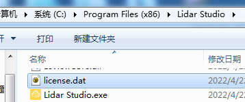

[中文版本](README_CN.md)

[知乎](https://zhuanlan.zhihu.com/p/504083964)

## Intro
Lidar Studio is a point cloud processing and analysis software independently developed by 武汉空间智测科技有限公司, which uses the Frontier technology of computer graphics to realize the rapid visualization and editing of massive point cloud data (supporting rendering and processing of point cloud data over 300G), and provides rich editing tools and advanced point cloud processing algorithms, which can be applied in surveying and mapping, electric power, agriculture, forestry , deep learning point cloud annotation and other industries.Lidar Studio also provide [SDK](https://github.com/lidarstudio/Lidar-Studio-SDK) for secondary development.

Lidar Studio realizes the rendering and editing of massive point cloud data through the custom point cloud format file lcdata. The lcdata data and standard LAS data can be converted to each other. After the conversion is completed, the rendering effect of massive point cloud data can be realized in seconds. The speed of converting lcdata is extremely fast.

Actual measurement 1: It takes about 58 minutes to convert the LAS data with a file size of 94.3GB and 3.9 billion points in a survey area, and the converted lcdata file is about 94.3GB.

Actual measurement 2: It takes about 41 seconds to convert the LAS data with a file size of 1.62GB and 60 million points in a survey area, and the converted lcdata file is about 1.4GB.

Remarks: All the above test results were done on the desktop with Intel(R) Core(TM) i7-7700, 32G memory and ordinary mechanical hard disk.

## Function and Features
Data management: provide basic point cloud data management tools, including data format conversion, import, export, delete and other operations.

Browsing: Provide a quick visual interface and smooth browsing operation for massive point cloud data, and provide rich rendering functions.

Measurement: provide basic data query and measurement functions, including interactive pick point, distance measurement, height measurement, angle measurement, area measurement, density measurement and other functions.

Data clipping: provides interactive data clipping function, including internal and external clipping.

Data editing: interactive profile editing is provided, and users can edit the classification attributes of point cloud and save them.

Foundation tools module: provides various functions of point cloud preprocessing, including denoising, downsampling, merging, extraction, coordinate transformation, etc.

Classification module: provides point cloud ground point classification function.

Terra module: provides tools for generating 4D products. Through the point cloud ground point extraction algorithm, the ground points in complex environment can be accurately extracted, and then DEM, DSM and other products can be generated.

## Software module authorization
|Module|Free version|Activate version|
|:----:|:--:|:--:|
|Massive point cloud Rendering|√|√|
|Massive point cloud Editing|√|√|
|Foundation tools|30 Days trial, 3 Months Apply for Use (multiple times)|√|
|Classification|30 Days trial, 3 Months Apply for Use (multiple times)|√|
|Terra|30 Days trial, 3 Months Apply for Use (multiple times)|√|

Note: After the trial expires, you can apply for the authorization code for 3 months by email, and you can apply for it multiple times. Please refer to the chapter "License Activation" in the user manual for the authorization code.

The main menu Help > License Activate, the License Activate dialog box pops up, fill in the name and company information, and select the activate modules.
Click the [Copy Information] button, send the copied information to lidarstudio@qq.com by email,
After obtain the license.dat, just copy it to the software installation directory (make sure the file name of the license is license.dat).



## Download resources
Software, user manual, tutorial video download address (Baidu network disk)
```
	Interlinkage：https://pan.baidu.com/s/1GgvWMf8kNGyYG7l12w9Wtg 
	Pick up code：69uh
```

## Contact us
The email address for product and authorization code application is lidarstudio@qq.com

## About us
武汉空间智测科技有限公司: focus on the research and development of the hardware and software of mobile measurement systems. The research and development results include mobile measurement systems of various carriers (airborne, vehicular, etc.) and professional point cloud processing software Lidar Studio. We aim to promote the high-quality development of the point cloud industry.
