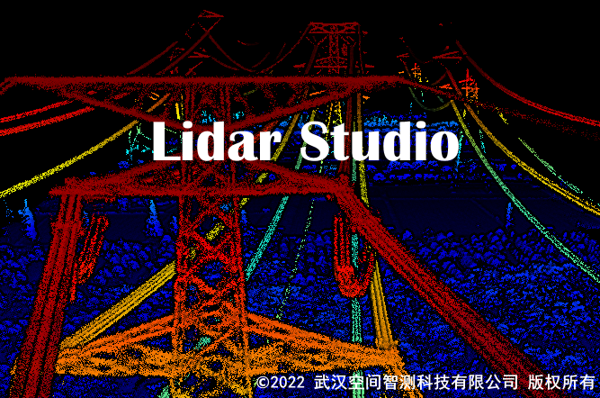

[English Version](README.md)

[知乎](https://zhuanlan.zhihu.com/p/504083964)

## 简介
Lidar Studio是武汉空间智测科技有限公司自主研发的点云数据处理与分析软件，利用计算机图形学的前沿技术，实现了海量点云数据的快速可视化与编辑（支持渲染、处理超过300G的点云数据），并提供丰富的编辑工具和先进的点云处理算法，可供测绘、电力、农林、深度学习点云标注等行业进行应用。此外，Lidar Studio提供[SDK](https://github.com/lidarstudio/Lidar-Studio-SDK)供二次开发使用。


Lidar Studio通过自定义的点云格式文件lcdata实现海量点云数据的渲染与编辑，lcdata数据与标准LAS数据可进行互转，转换完成后即可实现海量点云数据渲染“秒开”的效果。转换lcdata的速度是极快的。

实测一：对某测区94.3GB文件大小、39亿点的LAS数据进行转换，总耗时约58分钟，转换的lcdata文件约94.3GB。

实测二：对某测区1.62GB文件大小、6千万点的LAS数据进行转换，总耗时约41秒钟，转换的lcdata文件约1.4GB。

备注：以上所有测试结果均在Intel(R) Core(TM) i7-7700、内存32G、普通机械硬盘的台式机上完成。

## 功能与特色
数据管理：提供基本的点云数据管理工具，包括点云的数据格式转换，以及导入、导出、删除等操作。

显示浏览：提供海量数据点云文件的快速可视化界面及流畅的浏览操作，并提供丰富的渲染显示功能。

数据量测：提供基本的数据查询功能、量测功能，包括交互式点选、测距、测高、测角、测面积、测密度等功能。

数据裁剪：提供交互式数据裁剪功能，包括任意区域的内、外裁剪及保存。

数据编辑：提供交互式剖面编辑功能，用户可按需编辑数据块的类别属性并保存。

基础工具模块：提供点云预处理的各种功能，包含去噪、降采样、合并、提取、坐标变换等。

分类模块：提供点云地面点分类功能

地形模块：提供生成4D产品的工具。通过点云地面点提取算法可精确提取复杂环境下的地面点，进而生成DEM, DSM等产品。

## 软件模块授权
|模块|免费版本|激活版本|
|:----:|:--:|:--:|
|海量数据可视化|√|√|
|海量数据编辑|√|√|
|基础工具|30天试用，3个月申请使用（多次）|√|
|分类|30天试用，3个月申请使用（多次）|√|
|地形|30天试用，3个月申请使用（多次）|√|

注：试用到期后，可通过邮件申请3个月使用授权码，且可多次申请，申请授权码参考用户手册的“许可证激活“章节。

## 资源下载
软件、用户手册、教程视频下载地址（百度网盘）
```
	链接：https://pan.baidu.com/s/1GgvWMf8kNGyYG7l12w9Wtg 
	提取码：69uh
```

## 联系我们
产品问题与授权码申请邮箱为lidarstudio@qq.com

## 关于我们
武汉空间智测科技有限公司：专注于移动测量系统的软硬件研发工作，研发成果包括各种载体的移动测量系统（机载、车载等）以及专业的点云处理软件Lidar Studio，我们旨在推动点云行业高质量发展。
